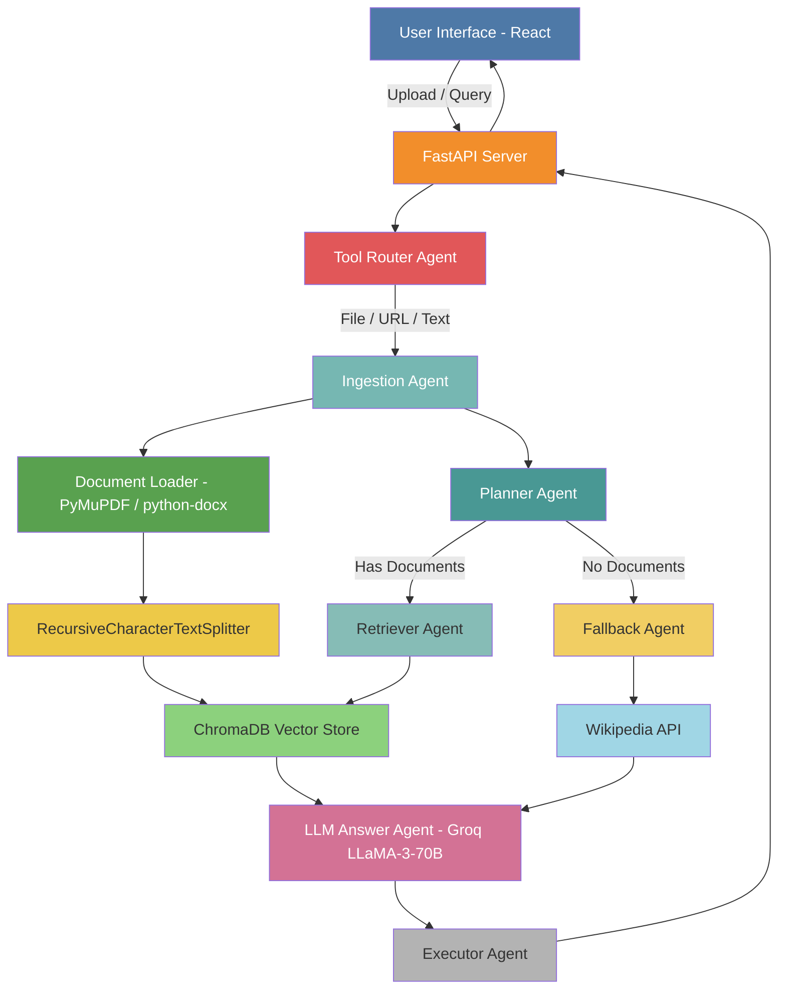

<div align="center">


<br/>

[](https://doc-mind.vercel.app)
[](https://namannanda-docmind-backend.hf.space)
[](https://namannanda-docmind-backend.hf.space/docs)

[](https://python.org)
[](https://fastapi.tiangolo.com)
[](https://python.langchain.com)
[](https://langchain-ai.github.io/langgraph)
[](https://reactjs.org)
[](https://www.trychroma.com)
[](https://groq.com)
[](https://docker.com)
[](LICENSE)

<br/>

> **Stop searching. Start asking.**
> DocMind is an **Agentic RAG system** that turns static documents into a living, queryable knowledge base. A **7-agent LangGraph pipeline** autonomously parses, embeds, retrieves, and generates accurate, citation-backed answers — delivering **10x productivity gains** over manual search.

<br/>


</div>


<div align="center">


| 🌐 Frontend | ⚡ Backend API | 📖 API Docs |
|---|---|---|
| [doc-mind.vercel.app](https://doc-mind.vercel.app) | [HuggingFace Space](https://namannanda-docmind-backend.hf.space) | [Swagger UI](https://namannanda-docmind-backend.hf.space/docs) |

</div>

---

## ✨ What is DocMind?

DocMind bridges the gap between **static documents** and **dynamic intelligence**. Traditional keyword search fails to understand context — DocMind doesn't.

Built on a **Monolithic Agentic Architecture** using FastAPI, LangGraph, and ChromaDB, DocMind intelligently parses, chunks, and semantically embeds your documents. It then routes natural language queries through a pipeline of 7 specialized agents that reason, retrieve, and respond — proactively switching between a **Vector Retriever** for precise in-document evidence and a **Wikipedia Fallback Agent** when internal data falls short.

Whether you're automating research, powering Level-1 support bots, or extracting insights from hundreds of files — DocMind transforms a repository of "dead" documents into an **active, decision-driving organizational brain**.

---

## 🚀 Features & Capabilities

| # | Module | Technology | Details |
|---|---|---|---|
| 1 | **Backend Framework** | FastAPI + Uvicorn | Async support, auto OpenAPI docs |
| 2 | **LLM Processing** | Groq + LLaMA-3-70B | Configurable temperature & model |
| 3 | **Document Parsing** | PyMuPDF + python-docx | PDF, DOCX, TXT with metadata |
| 4 | **Text Chunking** | RecursiveCharacterTextSplitter | Configurable chunk size & overlap |
| 5 | **Vector Embeddings** | all-MiniLM-L6-v2 | 384-dimensional semantic embeddings |
| 6 | **Vector Database** | ChromaDB | Persistent similarity search |
| 7 | **Agent Workflow** | LangGraph | 7 specialized agents with routing |
| 8 | **Web Fallback** | Wikipedia API | Auto-triggered on missing context |
| 9 | **User Interface** | React + TailwindCSS | Modern responsive SPA |
| 10 | **Containerization** | Docker + Docker Compose | Production-ready deployment |

---

## 🏗️ System Architecture



---

## 🧩 Design Patterns

| Pattern | Location | Purpose |
|---|---|---|
| **App Factory** | `app/__init__.py` | Configurable FastAPI app instantiation |
| **Singleton** | `services/*.py` | Single shared instances of LLM, embeddings & vector store |
| **Template Method** | `agents/base.py` | Common interface across all agents |
| **Strategy** | `agents/*.py` | Swappable, independent agent behaviors |
| **State Machine** | `workflow/graph.py` | LangGraph state transitions & conditional routing |
| **Repository** | `services/vector_store.py` | Abstracted data access layer |
| **Dependency Injection** | `config.py` | Environment-driven configuration |

---

## 🛠️ Technology Stack

<div align="center">

| Layer | Technologies |
|---|---|
| **Frontend** |    |
| **Backend** |    |
| **AI / Agents** |    |
| **Embeddings** |   |
| **Vector DB** |  |
| **DevOps** |     |

</div>

---

## 📁 Project Structure

```
DocMind/
│
├── 📂 .github/workflows/
│   ├── ⚙️  ci-cd.yml               # Full CI/CD pipeline
│   └── 🐳 docker.yml               # Docker build & push to GHCR
│
├── 📂 backend/
│   ├── 📂 app/
│   │   ├── 🤖 agents/
│   │   │   ├── base.py             # Base agent class (Template Method)
│   │   │   ├── executor.py         # Final response formatter
│   │   │   ├── fallback.py         # Wikipedia fallback agent
│   │   │   ├── ingestion.py        # Document ingestion agent
│   │   │   ├── llm_answer.py       # LLM response generation
│   │   │   ├── planner.py          # Execution planner
│   │   │   ├── retriever.py        # Semantic retriever agent
│   │   │   └── tool_router.py      # Input routing logic
│   │   │
│   │   ├── 🌐 api/
│   │   │   └── routes.py           # FastAPI route handlers
│   │   │
│   │   ├── ⚙️  core/
│   │   │   ├── models.py           # Pydantic data models
│   │   │   └── state.py            # LangGraph state management
│   │   │
│   │   ├── 🔧 services/
│   │   │   ├── embedding_service.py
│   │   │   ├── llm_service.py
│   │   │   ├── vector_store.py
│   │   │   └── wikipedia_service.py
│   │   │
│   │   ├── 🛠️  tools/
│   │   │   ├── document_loader.py  # PDF / DOCX / TXT / URL loader
│   │   │   └── text_splitter.py    # Recursive chunking logic
│   │   │
│   │   ├── 📊 utils/
│   │   │   ├── logger.py           # Rotating structured logger
│   │   │   └── validators.py
│   │   │
│   │   └── 🔄 workflow/
│   │       ├── edges.py            # Conditional routing edges
│   │       └── graph.py            # LangGraph pipeline definition
│   │
│   ├── 🧪 tests/                   # 100% coverage test suite
│   │   ├── test_agents/
│   │   ├── test_api/
│   │   ├── test_core/
│   │   ├── test_services/
│   │   ├── test_tools/
│   │   ├── test_utils/
│   │   └── test_workflow/
│   │
│   ├── 📓 notebooks/experiment.ipynb
│   ├── 🐳 Dockerfile
│   └── 📋 requirements.txt
│
├── 📂 frontend/
│   ├── 📂 src/
│   │   ├── App.jsx                 # Main React component
│   │   └── main.jsx                # React entry point
│   ├── 🐳 Dockerfile
│   ├── 📦 package.json
│   └── ⚡ vite.config.js
│
├── 🐳 docker-compose.yml
├── ⚙️  render.yml
└── 📖 README.md
```

---

## ⚡ Quick Start

### Prerequisites

- Python 3.11+
- Node.js 18+
- A free [Groq API key](https://console.groq.com)

### 1️⃣ Clone the Repository

```bash
git clone https://github.com/NeuroNaman/DocMind.git
cd DocMind
```

### 2️⃣ Backend Setup

```bash
# Create and activate virtual environment
python -m venv venv
source venv/bin/activate          # macOS / Linux
# venv\Scripts\activate           # Windows

# Install dependencies
pip install -r backend/requirements.txt

# Configure environment
cp backend/.env.example backend/.env
# Edit .env and add your Groq API key
```

**`.env` reference:**

```env
GROQ_API_KEY=your_groq_api_key_here
APP_ENV=development
LLM_MODEL=llama3-70b-8192
EMBEDDING_MODEL=all-MiniLM-L6-v2
CHUNK_SIZE=1000
CHUNK_OVERLAP=200
RETRIEVAL_K=3
```

```bash
python backend/run.py
```

> 🟢 Backend running at `http://localhost:8000`

### 3️⃣ Frontend Setup

```bash
cd frontend
npm install
npm run dev
```

> 🟢 Frontend running at `http://localhost:5173`

### 4️⃣ Docker — Full Stack (Recommended)

```bash
docker-compose up -d --build
```

> 🟢 Full app at `http://localhost:5000`
> Both React frontend and FastAPI backend are built into a **single multi-stage Docker image**.

---

## ⚙️ Configuration Reference

| Variable | Description | Default |
|---|---|---|
| `GROQ_API_KEY` | Groq API key *(required)* | — |
| `APP_ENV` | Runtime environment | `development` |
| `LLM_MODEL` | LLM model to use | `llama3-70b-8192` |
| `EMBEDDING_MODEL` | HuggingFace embedding model | `all-MiniLM-L6-v2` |
| `CHUNK_SIZE` | Characters per text chunk | `1000` |
| `CHUNK_OVERLAP` | Overlap between adjacent chunks | `200` |
| `RETRIEVAL_K` | Top-K chunks returned per query | `3` |

---

## 🌐 API Reference

| Endpoint | Method | Description |
|---|---|---|
| `/` | `GET` | Serves the web interface |
| `/health` | `GET` | Health check |
| `/docs` | `GET` | Interactive Swagger documentation |
| `/redoc` | `GET` | ReDoc API documentation |
| `/api/process` | `POST` | Submit a natural language query |
| `/api/documents/count` | `GET` | Number of indexed document chunks |
| `/api/documents/clear` | `POST` | Wipe the vector database |

### Example Request

```bash
curl -X POST "https://namannanda-docmind-backend.hf.space/api/process" \
  -H "Content-Type: application/json" \
  -d '{"query": "What are the key findings in the uploaded report?"}'
```

---

## 💡 How to Use

```
1. 📤  Upload a Document   →  PDF, DOCX, TXT, or paste a URL
2. ⚙️   Process             →  DocMind chunks & embeds your document
3. 💬  Ask a Question      →  Type any natural language query
4. 🧠  Get an AI Answer    →  Response cites source: Document or Wikipedia
```

---

## 🧪 Testing

```bash
cd backend

# Run all tests
pytest tests/ -v

# Run with HTML coverage report
pytest tests/ -v --cov=app --cov-report=html

# Run async tests
pytest tests/ -v --asyncio-mode=auto
```

### Testing Strategy

| Strategy | Approach |
|---|---|
| **Unit Testing** | All agents, services, and tools tested in isolation with `MagicMock` |
| **Edge Cases** | Empty inputs, invalid file types, oversized payloads, LLM downtime |
| **Integration** | Full LangGraph state transitions + FastAPI routes via `TestClient` |
| **Code Quality** | `black`, `flake8`, `isort` — strict PEP 8 compliance |
| **Coverage** | **100%** line coverage across the entire codebase |

---

## 🔄 CI/CD Pipeline

```
┌──────────┐   ┌──────────┐   ┌──────────────┐   ┌──────────┐   ┌──────────┐
│   Lint   │──▶│   Test   │──▶│   Security   │──▶│  Build   │──▶│  Deploy  │
│  black   │   │  pytest  │   │ Safety+Bandit│   │  Docker  │   │  Render  │
│  flake8  │   │ 100% cov │   │   scanning   │   │  image   │   │          │
└──────────┘   └──────────┘   └──────────────┘   └──────────┘   └──────────┘
```

| Workflow File | Trigger | Purpose |
|---|---|---|
| `ci-cd.yml` | Push / PR to `main` | Full lint → test → security → deploy pipeline |
| `docker.yml` | Release published | Build & push image to GitHub Container Registry |

**Required GitHub Secrets:**

| Secret | Description |
|---|---|
| `GROQ_API_KEY` | Used during automated test runs |
| `RENDER_DEPLOY_HOOK` | Webhook URL to trigger Render redeploy |

---

## 📊 Log Management

| Property | Detail |
|---|---|
| **Location** | `backend/logs/app.log` |
| **Rotation** | 10 MB per file · last 5 backups retained |
| **Format** | `YYYY-MM-DD HH:MM:SS \| logger \| LEVEL \| [file:line] \| message` |
| **INFO** | Operational events — requests, state transitions |
| **DEBUG** | Verbose output — development mode only |
| **ERROR** | Failures — full stack traces included |

---

## 🗺️ Roadmap

- [ ] 🔄 Streaming LLM responses via WebSocket
- [ ] 💾 Persistent vector storage across sessions
- [ ] 🎙️ Audio ingestion via OpenAI Whisper
- [ ] 👥 Multi-user document workspaces with access control
- [ ] 💬 Persistent chat history & memory viewer
- [ ] 🔌 Additional tools: WolframAlpha, SerpAPI, Arxiv, PubMed
- [ ] 🤖 Model selector UI: Gemini, GPT-4, Mistral, LLaMA
- [ ] 🌍 Multilingual document support

---

## 🤝 Contributing

Contributions are welcome! Here's how:

1. **Fork** the repository
2. **Create** your feature branch: `git checkout -b feature/amazing-feature`
3. **Commit** your changes: `git commit -m 'Add amazing feature'`
4. **Push** to the branch: `git push origin feature/amazing-feature`
5. **Open** a Pull Request

Please ensure all new code passes `pytest` with 100% coverage before submitting.

---

## 📄 License

This project is licensed under the **MIT License** — see the [LICENSE](LICENSE) file for details.

---

<div align="center">

### Built with ❤️ by [Naman Nanda](https://github.com/NeuroNaman)

*Artificial Intelligence / Machine Learning Developer*

[](https://github.com/NeuroNaman)

<br/>

⭐ **Found DocMind useful? A star goes a long way — thank you!** ⭐


</div>