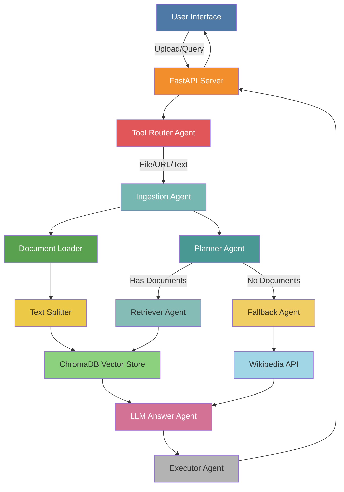

# AutoDocThinker: Agentic RAG System with Intelligent Search Engine

[](https://python.org) [](https://fastapi.tiangolo.com/) [](https://python.langchain.com/) [](https://langchain-ai.github.io/langgraph/) [](https://pytorch.org/) [](https://huggingface.co/) [](https://www.trychroma.com/) [](https://www.docker.com/) [](https://reactjs.org/) [](https://tailwindcss.com/) [](https://groq.com/)

**AutoDocThinker** is an advanced **Agentic RAG (Retrieval-Augmented Generation)** system designed to bridge the gap between static documents and dynamic intelligence, solving the critical problem of information overload in data-rich environments. By leveraging a **Monolithic Agentic Architecture** built with **FastAPI, LangGraph, and ChromaDB**, the system transforms unstructured data (PDFs, Word docs, Web URLs) into an interactive knowledge base, enabling users to query complex information using natural language. Unlike traditional keyword search that fails to understand context, AutoDocThinker utilizes a **multi-agent workflow** to intelligently parse, chunk, and embed documents, then proactively routes queries between a **Vector Retriever** for precise evidence and a **Wikipedia Fallback Agent** for broader context when internal data is insufficient. This end-to-end solution not only automates research and Level-1 support tasks but also delivers **10x productivity gains** by synthesizing accurate, citation-backed answers in seconds, effectively turning a repository of "dead" files into an active, decision-driving organizational brain.

[](https://github.com/user-attachments/assets/e2e9f89e-2d74-4004-8c9e-db0762f5cbb9)


---

## **Live Demo**

**Try it now**: [AutoDocThinker: Agentic RAG System with Intelligent Search Engine](https://autodocthinker.onrender.com/)

---

## **Features & Functionalities**

| #  | Module               | Technology Stack             | Implementation Details                   |
|----|----------------------|------------------------------|------------------------------------------|
| 1  | **Backend Framework**| FastAPI + Uvicorn            | Async support, auto OpenAPI docs         |
| 2  | **LLM Processing**   | Groq + LLaMA-3-70B           | Configurable temperature and model       |
| 3  | **Document Parsing** | PyMuPDF + python-docx        | PDF, DOCX, TXT with metadata preservation|
| 4  | **Text Chunking**    | RecursiveCharacterTextSplitter| Configurable chunk size and overlap     |
| 5  | **Vector Embeddings**| all-MiniLM-L6-v2             | Efficient 384-dimensional embeddings    |
| 6  | **Vector Database**  | ChromaDB                     | Persistent storage with similarity search|
| 7  | **Agent Workflow**   | LangGraph                    | 7 specialized agents with routing       |
| 8  | **Web Fallback**     | Wikipedia API                | Auto-triggered when no documents         |
| 9  | **User Interface**   | HTML, CSS, JavaScript        | Modern responsive design                 |
| 10 | **Containerization** | Docker + Docker Compose      | Production-ready deployment             |

---

## **Project Structure**

```
AutoDocThinker/
├── .github/
│   ├── workflows/
│   │   ├── ci-cd.yml
│   │   ├── docker.yml
│   │   ├── main.yml
|   |
├── backend/                          # Backend application (FastAPI)
│   ├── .env.example                  # Environment variables template
│   ├── Dockerfile                    # Backend Docker
│   ├── .dockerignore
│   ├── pyproject.toml
│   ├── requirements.txt              # Python dependencies
│   ├── run.py
│   ├── setup.py
│   ├── app/                          # Main application package
│   │   ├── config.py                 # Application configuration
│   │   ├── exceptions.py
│   │   ├── __init__.py               # App factory & initialization
│   │   ├── agents/                   # Agent implementations
│   │   │   ├── base.py               # Base agent class
│   │   │   ├── executor.py           # Final response formatter
│   │   │   ├── fallback.py           # Wikipedia fallback agent
│   │   │   ├── ingestion.py          # Document ingestion agent
│   │   │   ├── llm_answer.py         # LLM response generation
│   │   │   ├── planner.py            # Execution planner
│   │   │   ├── retriever.py          # Document retriever
│   │   │   ├── tool_router.py        # Tool routing logic
│   │   │   ├── __init__.py
│   │   ├── api/                      # API endpoints
│   │   │   ├── routes.py             # Main API routes
│   │   │   ├── __init__.py
│   │   ├── core/                     # Core business logic
│   │   │   ├── models.py             # Pydantic models
│   │   │   ├── state.py              # State management
│   │   │   ├── __init__.py
│   │   ├── services/                 # External services
│   │   │   ├── embedding_service.py  # Embedding generation
│   │   │   ├── llm_service.py        # LLM interaction
│   │   │   ├── vector_store.py       # Vector DB interface
│   │   │   ├── wikipedia_service.py
│   │   │   ├── __init__.py
│   │   ├── tools/                    # Helper tools
│   │   │   ├── document_loader.py    # Document loading logic
│   │   │   ├── text_splitter.py
│   │   │   ├── __init__.py
│   │   ├── utils/                    # Utilities
│   │   │   ├── logger.py             # Logging configuration
│   │   │   ├── validators.py
│   │   │   ├── __init__.py
│   │   ├── workflow/                 # Workflow orchestration
│   │   │   ├── edges.py
│   │   │   ├── graph.py              # LangGraph workflow definition
│   │   │   ├── __init__.py
│   ├── data/
│   │   ├── (Sample documents)
│   ├── logs/
│   │   ├── app.log                   # Application logs
│   ├── notebooks/
│   │   ├── experiment.ipynb
│   ├── tests/                        # Test suite
│   │   ├── conftest.py               # Test fixtures
│   │   ├── test_app.py
│   │   ├── test_coverage_improvements.py
│   │   ├── test_exceptions.py        # Exception handling tests
│   │   ├── __init__.py
│   │   ├── test_agents/              # Agent logic tests
│   │   │   ├── test_base.py
│   │   │   ├── test_executor.py
│   │   │   ├── test_fallback.py
│   │   │   ├── test_ingestion.py
│   │   │   ├── test_llm_answer.py
│   │   │   ├── test_planner.py
│   │   │   ├── test_retriever.py
│   │   │   ├── test_tool_router.py
│   │   │   ├── __init__.py
│   │   ├── test_api/                 # API endpoint tests
│   │   │   ├── test_routes.py
│   │   │   ├── __init__.py
│   │   ├── test_core/                # Core model tests
│   │   │   ├── test_models.py
│   │   │   ├── __init__.py
│   │   ├── test_services/            # External service tests
│   │   │   ├── test_embedding_service.py
│   │   │   ├── test_llm_service.py
│   │   │   ├── test_vector_store.py
│   │   │   ├── test_wikipedia_service.py
│   │   │   ├── __init__.py
│   │   ├── test_tools/               # Helper tool tests
│   │   │   ├── test_document_loader.py
│   │   │   ├── test_text_splitter.py
│   │   │   ├── __init__.py
│   │   ├── test_utils/               # Utility function tests
│   │   │   ├── test_logger.py
│   │   │   ├── test_validators.py
│   │   │   ├── __init__.py
│   │   ├── test_workflow/            # Workflow graph tests
│   │   │   ├── test_edges.py
│   │   │   ├── test_graph.py
│   │   │   ├── __init__.py
│   ├── uploads/
│   │   ├── (User uploads)
│   ├── vector_db/
│   │   ├── (ChromaDB files)
│
├── frontend/                         # Frontend application (React)
│   ├── .gitignore
│   ├── .dockerignore
│   ├── Dockerfile                    # Frontend Docker configuration
│   ├── eslint.config.js
│   ├── index.html                    # Entry HTML file
│   ├── package-lock.json
│   ├── package.json                  # Node.js dependencies
│   ├── postcss.config.js
│   ├── README.md
│   ├── tailwind.config.js            # Tailwind CSS configuration
│   ├── vite.config.js                # Vite configuration
│   ├── public/
│   │   ├── vite.svg
│   ├── src/
│   │   ├── App.css
│   │   ├── App.jsx                   # Main React component
│   │   ├── index.css                 # Global styles
│   │   ├── main.jsx                  # React entry point
│   │   ├── assets/
│   │   │   ├── react.svg
│
├── .gitignore
├── docker-compose.yml                # Docker Compose orchestration
├── LICENSE
├── Demo.png
├── Demo.mp4
├── README.md
├── render.yml
├── run.py                            # Main project entry point
```

---

## **Architecture Pattern: Monolithic Agentic Architecture**

This project follows a **Monolithic Agentic Architecture** with the following design patterns:

| Pattern | Where Used | Purpose |
|---------|------------|---------|
| **App Factory** | `app/__init__.py` | Configurable FastAPI app creation |
| **Singleton** | `services/*.py` | Single instance of shared services |
| **Template Method** | `agents/base.py` | Common agent interface |
| **Strategy** | `agents/*.py` | Different agent behaviors |
| **State Machine** | `workflow/graph.py` | LangGraph state transitions |
| **Repository** | `services/vector_store.py` | Data access abstraction |
| **Dependency Injection** | `config.py` | Environment-based configuration |

---

## **System Architecture**



---

## **Installation**

### Prerequisites

- Python 3.11+
- Groq API Key

### Using pip

```bash
# Clone the repository
git clone https://github.com/Md-Emon-Hasan/AutoDocThinker.git
cd AutoDocThinker

# Create virtual environment
python -m venv venv
source venv/bin/activate  # Windows: venv\Scripts\activate

# Install dependencies
pip install -r requirements.txt

# Copy and configure environment
cp .env.example .env
# Edit .env with your API keys

# Run the application
python run.py
```

### Using Docker

The project includes a **Root Multi-stage Dockerfile** that builds both the React frontend and the FastAPI backend into a single container.

```bash
# RECOMMENDED: Build and run with Docker Compose
docker-compose up -d --build

# OR: Build the root Docker image manually
docker build -t auto-doc-thinker .

# Run the container
docker run -p 5000:5000 --env-file .env auto-doc-thinker
```

> [!NOTE]
> The container serves the **Frontend UI at the same port as the Backend (5000)** when built via Docker.


---

## **Configuration**

Key environment variables in `.env`:

| Variable | Description | Default |
|----------|-------------|---------|
| `APP_ENV` | Environment mode | development |
| `GROQ_API_KEY` | Groq API key | required |
| `LLM_MODEL` | LLM model name | openai/gpt-oss-120b |
| `EMBEDDING_MODEL` | Embedding model | all-MiniLM-L6-v2 |
| `CHUNK_SIZE` | Text chunk size | 1000 |
| `CHUNK_OVERLAP` | Chunk overlap | 200 |
| `RETRIEVAL_K` | Number of chunks to retrieve | 3 |

---

## **API Endpoints**

| Endpoint | Method | Description |
|----------|--------|-------------|
| `/` | GET | Main web interface |
| `/health` | GET | Health check |
| `/docs` | GET | Swagger API documentation |
| `/redoc` | GET | ReDoc API documentation |
| `/api/process` | POST | Process query with document |
| `/api/documents/count` | GET | Get document count |
| `/api/documents/clear` | POST | Clear all documents |

---

## **Usage**

1. **Upload a Document**: Choose PDF, DOCX, TXT, or paste URL/text
2. **Click "Process Document"**: System creates embeddings
3. **Ask Questions**: Chat with your document using natural language
4. **Get AI Answers**: Responses include source (Document or Wikipedia)

---

## **Running Tests**

### Backend Tests
Navigate to the `backend` directory first:

```bash
cd backend
```

Then run the tests:

```bash
# Run all tests
pytest tests/ -v

# Run with coverage
pytest tests/ -v --cov=app --cov-report=html

# Run async tests
pytest tests/ -v --asyncio-mode=auto
```

---

## **Testing Strategy & Quality Assurance**

We employ a comprehensive testing strategy using **Pytest** and **unittest.mock** to ensure reliability and maintainability.

### **1. Unit Testing (White-Box Testing)**
- **Isolation**: Each component (Agents, Tools, Services) is tested in isolation.
- **Mocking**: External dependencies (Groq API, ChromaDB, Wikipedia) are mocked to ensure tests are deterministic and do not require network access.
- **Technique**: We use `patch` and `MagicMock` to simulate external behaviors and error conditions.

### **2. Edge Case & Error Handling**
- **Boundary Value Analysis**: Testing empty inputs, invalid file types, and large payloads.
- **Exception Handling**: Verifying that the system gracefully handles API failures (e.g., LLM downtime) and raises appropriate custom exceptions.

### **3. Integration Testing (Simulated)**
- **Workflow Graph**: We test the entire LangGraph workflow by simulating state transitions between agents.
- **API Endpoints**: Testing FastAPI routes with `TestClient` to ensure correct HTTP status codes and response schemas.

### **4. Code Quality Metrics**
- **100% Test Coverage**: Every line of code is executed during testing.
- **Linting**: Strict adherence to **PEP 8** standards using `flake8`, `isort`, and `black`.
- **Type Safety**: Pydantic models ensure runtime data validation.

---

## **Log Management**

The application uses a structured logging system for monitoring and debugging.

- **Storage**: Logs are stored in `logs/app.log`.
- **Rotation**: Automatic log rotation (10MB per file, keeping last 5 backups) prevents disk overflow.
- **Format**: `YYYY-MM-DD HH:MM:SS - logger_name - LEVEL - [file:line] - message`
- **Levels**: 
  - `INFO`: General operational events (requests, state transitions).
  - `DEBUG`: Detailed debugging information (only in development).
  - `ERROR`: Exceptions and critical failures (stack traces included).

---

## **Tech Stack**

| Category | Technologies |
|----------|--------------|
| **Backend** | FastAPI, Uvicorn, Python 3.11 |
| **AI/ML** | LangChain, LangGraph, Groq, HuggingFace |
| **Database** | ChromaDB (Vector Store) |
| **Frontend** | HTML5, CSS3, JavaScript |
| **DevOps** | Docker, Docker Compose, GitHub Actions |

---

## **CI/CD Pipeline**

This project uses **GitHub Actions** for continuous integration and deployment.

### Pipeline Stages

```
┌─────────┐    ┌─────────┐    ┌──────────┐    ┌─────────┐    ┌──────────┐
│  Lint   │───▶│  Test   │───▶│ Security │───▶│  Build  │───▶│  Deploy  │
│ (Black, │    │(pytest) │    │ (Safety, │    │(Docker) │    │ (Render) │
│ Flake8) │    │         │    │  Bandit) │    │         │    │          │
└─────────┘    └─────────┘    └──────────┘    └─────────┘    └──────────┘
```

### Workflow Files

| File | Trigger | Purpose |
|------|---------|---------|
| `ci-cd.yml` | Push/PR to main | Full CI/CD pipeline |
| `docker.yml` | Release published | Build & push to GHCR |

### Required Secrets

| Secret | Description |
|--------|-------------|
| `GROQ_API_KEY` | Groq API key for testing |
| `RENDER_DEPLOY_HOOK` | Render deploy webhook URL |

---

## **Future Enhancements**

- [ ] Multilingual document ingestion
- [ ] Audio document ingestion + Whisper
- [ ] Long-term memory + history viewer
- [ ] MongoDB/FAISS alternative for Chroma
- [ ] More tools (WolframAlpha, SerpAPI)
- [ ] Model selection dropdown (Gemini, LLaMA, GPT-4)
- [ ] WebSocket for real-time streaming

---

## **Author**

**Md Emon Hasan**

- Email: [emon.mlengineer@gmail.com](mailto:emon.mlengineer@gmail.com)
- LinkedIn: [md-emon-hasan](https://www.linkedin.com/in/md-emon-hasan-695483237/)
- GitHub: [Md-Emon-Hasan](https://github.com/Md-Emon-Hasan)
- Facebook: [Md-Emon-Hasan](https://www.facebook.com/mdemon.hasan2001/)
- WhatsApp: [+8801834363533](https://wa.me/8801834363533)

---

## **License**

MIT License - see [LICENSE](LICENSE) file for details.

---

## **Contributing**

Contributions are welcome! Please feel free to submit a Pull Request.

1. Fork the repository
2. Create your feature branch (`git checkout -b feature/AmazingFeature`)
3. Commit your changes (`git commit -m 'Add some AmazingFeature'`)
4. Push to the branch (`git push origin feature/AmazingFeature`)
5. Open a Pull Request